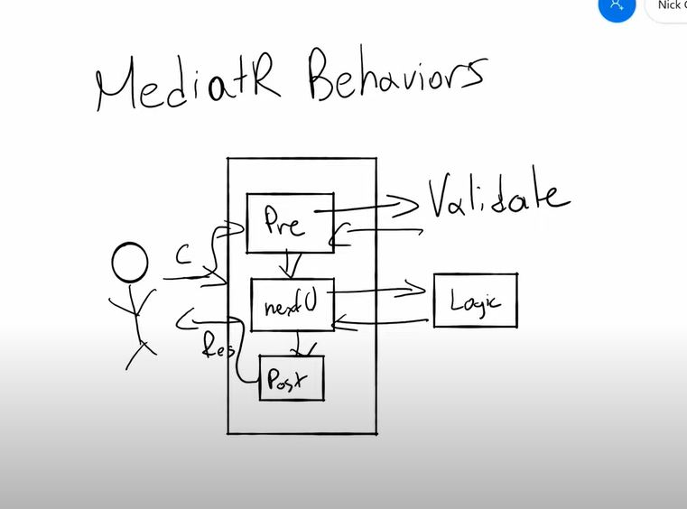

# AspCoreMediatR

MediatR helps reducing the dependency injections on a service by identfy the dependency using the request pattern and serving the relevent implemetation.

<ol>
    <li>
        Install Mediatr and MediatR.Extensions.Microsoft.DependencyInjection packages
    </li>
    <li>
        In Startup.cs Configure method add
        <pre>
            services.AddMediatR(typeof(Startup));
        </pre>
    </li>
    <li>Create Response Class</li>
    <li>
        Create Response class that inherits  <b>IRequest&lt;ResponseObejct&gt;</b>
    </li>
    <li>
        Create Handler class that Inherits <b>IrequestHandler&lt;Request, Response&gt;</b>
    </li>
    <li>
        In controller inject IMediatR and call the method from method with specifying Response object along with request input parameter.
    </li>
</ol>

    Other than routing our request to a correct handler there is another facility is in MediatR is call MediatR PipeLine. 
        Request comes to mediatR but this time there is three level of layer <b>Pre, Next, Post</b> 
        We can have our Validation, Begin transaction in this pre layer, Next will call the actual logic and post we can commit or rollback our transaction. 
        

